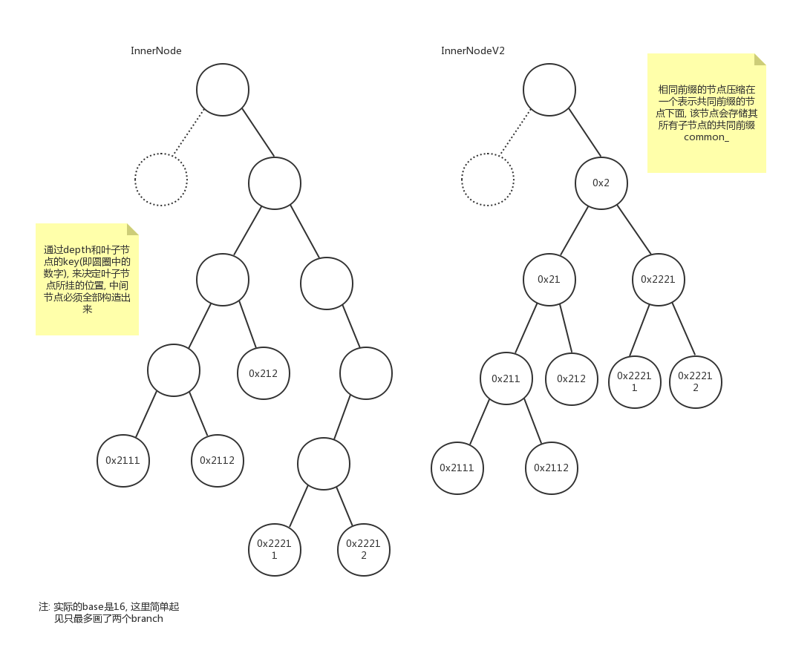
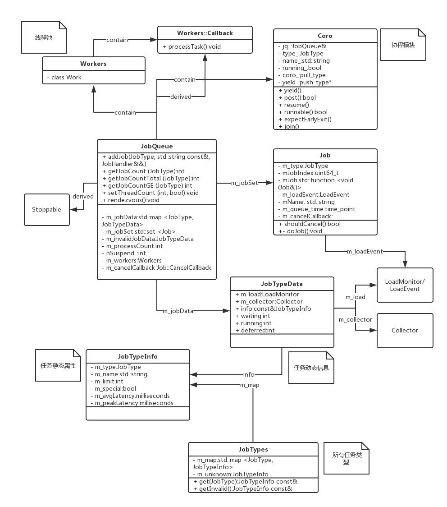
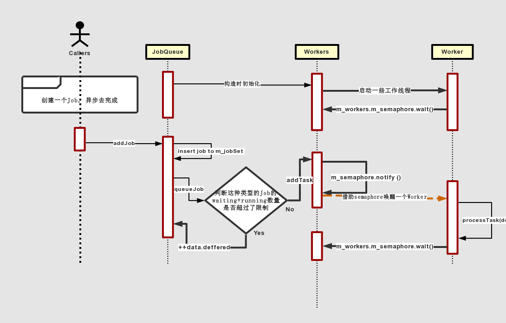

# about block-chain

  - boost 1_66_0加入了boost::asio::threadpool (or thread_pool??)
  - boost 1_64_0加入了boost::beast

```
  - Ripple的sync filter有好几种, 分别连接着DB或NodeCache
  - ETH的state以SecureTrieDB<Address, OverlayDB>维护, 主要操作即为增删改查
  - HyperLedger的MQ是kafka(+zookeeper)
  - ETH: EthereumHost包含一个EthereumPeerObserverFace, 处理peer发来的tx, 然后塞到Client下的TransactionQueue里进行后续处理
  - Ripple: 类似结构是InboundLedger, 从NodeStore或SHAMap中将信息读取出来发给Peer; TxQ是处理和Account, Fee相关的内容
  - BTC: 类似结构是QueuedBlock, 而且是从磁盘里将block信息读取出来然后发给peer的; 还有一个CTxMemPool, 应该是为了UTXO的关联而做的, 它使用多索引容器indexed_transaction_set来保存tx相关信息, net_processing.cpp
```

## InnerNode vs InnerNodeV2 in Ripple


InnerNodeV2与ETH中的MemTrie应该是类似的实现(ETH中的TrieDB还没具体看, 它又和RLP揉在了一起略微有些复杂), 能够对中间节点进行最大限度地压缩, 最大限度降低大量中间节点对空间的占用, 付出的代价仅仅是增加了一个common_字段来表示其所有子节点的共同前缀

注意: InnerNode在某个branch只有一个叶子节点时, 也可以将其路径上多余的非叶子节点省去, 但对于大于一个叶子节点的情况, 则无法再进行压缩; SHAMap.h中也提到了该特性: 

`2. A node with only one child is merged with that child(the "merge property")`

## MerkleTree
- Ripple:
```
  1. SHAMapNodeID中mNodeID(uint256)是root到当前节点的branch路径, 32个字节, 每个字节表示两层, 最多表示64层(从0层开始到63层), 高4位表示奇数层, 低4位表示偶数层, 4位正好能表示16个数字即16个branch; 所以mDepth/2对应于一个字节, 其中高4位对应奇数层, 低4位对应偶数层; 这些mNodeID是根据叶子节点的data的hash而来的
  2. 一棵树上的节点要么全是InnerNode, 要么全是InnerNodeV2
  3. InnerNodeV2类似于ETH的InfixNode, 存了一个branch的共同前缀, 然后以后面的部分作为branch的key; InnerNode没有这个概念直接以0-15的数字为key存储branch
  4. backend是连接后端DB的, kv DataBase只是一层封装, 同时含有Cache, DataBaseNode即为NodeStore
  5. pCache_: positive cache, 真正的缓存
  6. nCache_: negative cache, 哪些key我们没有
  7. DataBaseNodeImp是普通DB; DataBaseRotate会创建两个DB, 可以像日志一样做rotate(专门起了一个线程); DataBaseShard将Ledger存到磁盘上方便归档和传递, 每个Shard会存固定数量的Ledger; 每种DB都有pCache, nCache缓存, 也都有backend可以连接后端DB
  8. backend目前支持MemoryDB, NuDB, RocksDB以及NullDB
  9. NodeObject的类型有: Ledger, account以及tx; SHAMap的Node类型有: inner, tx_nm, tx_md, account(没有Ledger)
  10. NodeStoreScheduler可以通过addJob的方式将batchWrite异步完成
```

- BTC:
```
  1. uint32的index每一位0或1表示左右子树, 因此树的深度最多是32; 
  2. 叶子节点的height是0, 上升过程中值依次增加; 
  3. merkle.cpp是merkle树的核心, merkleblock.cpp只是一个有部分节点的merkle tree(二叉树), 依据规则(如bloom filter)将对方感兴趣的交易信息转发给其他节点或是响应JSONRPC消息; 
  4. ComputeMerkleRootFromBranch: 已知一个叶子节点和到root的整条路径的hash, 计算root hash
  5. ComputeMerkleRoot: 已知所有叶子节点, 计算root hash
  6. tx的结构: std::vector<std::shared_ptr<const CTransaction>>, std::vector<uint256>
  7. MerkleComputation()中uint256 inner[32]的说明: inner is an array of eagerly computed subtree hashes, indexed by tree level (0 being the leaves). For example, when count is 25 (11001 in binary), inner[4] is the hash of the first 16 leaves, inner[3] of the next 8 leaves, and inner[0] equal to the last leaf. The other inner entries are undefined. (可参考下图)
```


- ETH: 
```
  1. 它的memory trie也是一个base-16的radix tree(与ripple一样), 但在它之上又做了一些修改, 称之为trie, 即单词查找树; 通过asNibbles将每个字节拆成余数和商的部分(均在0-15之间), 作为key; 
  2. newBranch时, 设k1和k2的共同前缀长度是p-1, 如果p等于k1.size()那么以v1作为m_value, k2[p+1]作为m_nodes下标, 以k2[p+2]和v2构造新的叶子节点; 否则如果p等于k2.size()那么以v2作为m_value, k1[p+1]作为m_nodes下标, 以k1[p+2]和v1构造新的叶子节点; 否则分别以k1[p+1], k2[p+1]作为m_nodes下标, v1, v2构造新的叶子节点; 最后如果p不等于0, 以共同前缀作为key, 刚刚new出来的BranchNode为m_next构造InfixNode并返回; 否则直接返回BranchNode;
  3. InfixNode的m_next只可能是BranchNode或它自己; LeafNode也可以没有key;
  4. TrieDB: 以DB(但可能是MemoryDB)作为backend的trie, 数据都是以RLP方式编码实现的Trie(需要再看一下代码);
  5. OverlayDB(derived from MemoryDB)是连接真正backend DB的桥梁
  6. tx的结构: std::vector<Transaction>, std::unordered_set<h256>
  7. 一个RLP就是一个节点, 是否是叶子节点在内部有标志位表示, 而不是单独定义一个class(像ripple一样); 一个RLP只要非空, itemCount只可能有两种: 2和17. 2是叶子节点, 17是中间节点, 所以它的中间节点之间是16个branch, 最后与叶子节点的连接只有2个branch

  memory trie:
  1. 插入:
    - LeafNode 覆盖或newBranch
    - InfixNode 如果当前节点是key的前缀, 以key的前缀后的部分作为可以, 和value一起调用m_next的insert; 否则先计算共同前缀的长度, 如果不为0的话, 删掉当前节点的共同前缀, 然后再new一个以共同前缀为m_ext, 以以共同前缀后的部分和value一起insert返回的节点为m_next的InfixNode; 如果共同前缀长度为0, 再将m_ext拆为第一个字节和后面的部分, 以第一个字节new一个BranchNode, 然后插入其中
    - BranchNode m_value可以存没有key的value; 如果m_nodes[key[0]]没有, 那么直接new一个以key[1]之后为key和value一起的LeafNode; 如果有, 调用它的insert函数(类似于一开始root节点相关的处理)
  2. 删除:
    - LeafNode 直接删
    - InfixNode 先尝试删前缀部分的节点(调用m_next的remove), 删完之后返回的节点如果不为nullptr应该肯定就是TrieExtNode的子类(即不是BranchNode), 如果不是的话这个InfixNode也没有意义了, 直接删掉,否则merge with child
    - BranchNode 如果没有key, 可以直接清掉m_value, 否则如果有m_nodes[key[0]], 直接调用它的remove函数; 这两种情况下均需要调用rejig()
```

## 模块管理
- Ripple: 模块继承Stoppable类之后可以通过add函数将其他模块添加为自己的子类(子类也继承于Stoppable), 并允许以此重复下去形成一课树, 从而实现将之间有关系的模块共同管理的需求(按先父类后子类的顺序prepare, start, stop等)
- EOS: plugin模式, 各plugin编译为library, 同时继承自统一的基类, 实现之间关系扁平化的统一管理(可以有线性依赖关系, 但没有树状的层级关系, 顺序初始化)

## Test
- ETH: 使用boost UTF，编译成独立的bin--testeth
- BTC: 使用boost UTF进行UT，python脚本进行ST
- Ripple: 使用boost UTF，编译进ripple主程序中，使用ripple unittest的方式执行
- EOS: 使用boost UTF

## JobQueue
- ETH：以derived class继承Worker类的方式，获得worker线程的能力，进而通过override doWork等虚函数实现自己所需的在worker线程中干活的逻辑；线程管理也较简单，直接使用std::thread，且仅在交易验证，区块验证，监听端口，处理连接，CPU挖矿以及Worker内部等场景使用；
- BTC：有一个CScheduler类来实现JobQueue，但只起了一个线程去做，没有线程池，与脚本检查一样，使用boost的thread_group的create_thread创建线程；在执行某些参数的命令，HTTP server，UPnP，以及网络交互等场景时，直接使用std::thread；HTTP server使用了evhttp，以libevent做为event loop；与peer之间的网络通过原生接口处理(socket, connect, send, recv, listen, accept等)，没有I/O复用框架（每种网络行为起一个专门的线程去处理）
- FreeBSD: pthread_workqueue
- Ripple：使用JobQueue以及线程池Workers，具体请参考下图



## 参数or配置：
- ETH: 使用boost::program_options解析命令行参数，config文件用JSON解析
- BTC: 自己解析命令行参数，config文件使用boost::program_options解析
- Ripple: 使用boost::program_options解析命令行参数，config文件自己解析

## 分布式MQ
- RabbitMQ
- RocketMQ
- ZeroMQ
- ActiveMQ
- Redis
- kafka/jafka

## ripple
- standalone模式会有可能使用临时的DB，

1. 使用boost的program_options去解析命令行参数，然后在Config::loadFromString函数中去解析配置文件的每一个section和字段；
2. ApplicationImp的setup函数是整个程序初始化资源的核心。首先设置job queue的线程数量，根据该数量会reuse或new出来新的worker（即thread）；接着将
debug文件的输出级别调到kDebug或比它更低；
3. 然后如果是非standalone模式，则开始启动SNTPClinet模块。在启动SNTPClient模块时通过std::thread起了一个线程去处理与NTP服务器的交互，也有一个定时器
去周期性地发起与NTP服务器之间的通信；SNTPClock.cpp中的resolveComplete()函数里有一个地方到了36年会溢出（"The following line of code will 
overflow at 2036-02-07 06:28:16 UTC due to the 32 bit cast."）;
4. 接着初始化sqlite的3个DB（tx, ledger, wallet），包括执行建表以及创建相关索引的语句；
5. 接着InitPathTable；
6. 然后即开始startGenesisLedger；
7. 接着执行loadNodeIdentity加载本节点的pk，sk，优先通过配置文件里的node_seed来生成，其次尝试从walletDB中获取，都失败的话最后会尝试随机生成一对；
8. 接着建立信任的validators，即通过validators_->load以及validatorSites_->load；
9. 接着根据配置文件中指定的node_size，设置内存中一些Cache的TargetSize和TargetAge；
10. 接着即开始创建overlay对象

## SHAMap in ripple
(以下为源码中shamap目录下README.md文件的翻译)
### SHAMap 介绍
SHAMap是一个Merkle tree(http://en.wikipedia.org/wiki/Merkle_tree)，
也是一个最多16个子节点的radix tree(http://en.wikipedia.org/wiki/Radix_tree).

一个给定的SHAMap永远只存储以下三种类型的数据之一：
1. 带有元数据的交易
2. 不带有元数据的交易
3. 账户状态

所以一个特定的SHAMap上的所有叶子节点都会有一个统一的类型，内部节点（非叶子节点）除了它下面节点的hash值以外不携带任何数据。

### SHAMap 类型
创建和使用SHAMap有两种不同的方式：
1. 可变的SHAMap
2. 不可变的SHAMap

这两种方式的区别并不是那种经典C++中的不可变意味着不改变的语义。一个不可变的SHAMap包含着不可变的"节点"。并且，一旦在一个不可变的SHAMap上找到了一个节点，那么在这个SHAMap的整个生命周期中该节点一定会被保持在该SHAMap上。所以，有点反直觉的是，一个不可变的SHAMap可能由于新节点地加入而增长，但是一个不可变的SHAMap永远不会变小（直到它被销毁时完全消失）。一个节点一旦被加入进不可变的SHAMap，也永远不会改变它在内存中的位置。所以不可变SHAMap中的节点可以使用原始指针来操作（如果你足够小心的话）。

这种设计的其中一个后果就是一个SHAMap永远不可能被“裁剪”。没有任何办法可以识别那些在SHAMap中不需要了的可以被移除的节点。一旦一个节点被加入了内存中的SHAMap，这个节点将在整个SHAMap的整个生命周期内始终保持在内存中。

大多数SHAMap是不可变的，它们不会修改或移除它们所包含的节点。

一个需要可变SHAMap的例子是当我们希望向LCL去实施交易时。为此我们生成一个状态树的可变快照，然后开始将交易实施于它。由于该快照是可变的，改变该快照中的节点不会影响其他SHAMap中的节点。

一个使用不可变ledger的的例子是当有一个open的ledger时，一些代码想要去查询该ledger的状态。这时我们不想去改变SHAMap的状态，所以我们使用了一个不可变的快照。

### SHAMap 创建
一个SHAMap通常不是凭空创建的。一旦一个初始的SHAMap被构造了出来，之后的SHAMap通常基于初始SHAMap调用snapShot(bool isMutable)被创建出来。这个新创建出来的SHAMap根据传入的标记以拥有着所需的特性（可变或不可变）。

产生一个SHAMap的不可变的快照相对于产生一个可变的快照来说非常廉价. 如果一个SHAMap快照是可变的, 那么其中任何可能被修改的节点在它们被置于可变map之前必须被复制一份.

### SHAMap 线程安全性

*这个描述是过时的, 需要重写*

SHAMaps可以是线程安全的, 取决于它们是如何被使用的. SHAMap使用一个SyncUnorderedMap用于它的存储. SyncUnorderedMap有3个线程安全的方法:
1. size()
2. canonicalize()
3. retrieve()

只要SHAMap只使用这3个接口来操作它的存储(变量mTNByID代表Tree Node的ID), SHAMap就是线程安全的.

### 遍历一个SHAMap
*我们需要一个关于为什么有时需要遍历一个SHAMap以及在代码中是如何工作的好的描述*

### 晚到达的节点
就像我们之前提到的一样，SHAMap（即使是不可变的）可能会增长。如果一个SHAMap正在查询某个节点然后运行到了一个空点，那么SHAMap将查看该节点是否存在但还没有成为该map的一部分。这个操作是在SHAMap::fetchNodeExternalNT()函数中进行的。“NT”在这里表示不会抛出异常。

函数fetchNodeExternalNT()会经历三个阶段：
1. 通过调用getCache()来尝试找到TreeNodeCache中丢失节点的位置。TreeNodeCache是不可变的SHAMapTreeNodes的cache，不可变的SHAMapTreeNodes被所有SHAMap共享。

任何一个不可变的SHAMapTreeNode都有一个为0的序列号。当一个可变的SHAMap被创建出来时，它的SHAMapTreeNodes被给予了一个非0的序列号。所以断言assert (ret->getSeq() == 0)简单地确认了TreeNodeCache确实给了我们一个不可变的节点。

2. 如果这个节点不在TreeNodeCache中，我们尝试从数据库保存的历史数据中找到它。调用fetch(hash)为我们完成了这项工作。

3. 最后，如果ledgerSeq_不为0，且我们没有在历史数据中找到该节点，我们会调用一个MissingNodeHandler。
   非0的ledgerSeq_表示这个SHAMap是一个属于某个指定（非0）序列号的历史ledger的完整map。所以，如果所有预期的数据都总是存在，MissingNodeHandler永远不应该被执行。
   并且，由于我们知道这个SHAMap并不能完全表示该ledger中的全部数据，我们将该SHAMap的序列号置为0。

如果阶段1返回了节点，那么我们就已经知道了这个节点是不可变的。然而如果任何一个阶段2执行成功，我们就需要将返回的节点转变为一个不可变的节点。这通过在try块中调用make_shared<SHAMapTreeNode>来实现。这些代码写在了try块里是因为fetchNodeExternalNT方法承诺了不会抛出异常。我们不想由于make_shared调用构造函数时抛出异常而破坏我们的承诺。  

### 规范化
调用canonicalize()可以确保所关注的节点是否已经在SHAMap上了, 这时我们会返回已经存在了的那个节点--我们永远不会替换掉一个早已经存在的节点. 通过使用canonicalize()我们管理了一个线程竞态条件, 即两个不同的线程可能同时认识到某个SHAMapTreeNode的缺失. 如果它们都尝试插入节点, 那么canonicalize()确保了第一个节点将获胜, 并且稍慢的线程会收到更快的那个线程插入的节点的指针.

现在SHAMap关于canonicalize()所考虑的事情的设计有一个问题. 两个不同的tree可以拥有两个完全一样(相同的hash值)但ID不同的节点. 如果TreeNodeCache返回了一个有着相同hash但不同ID的节点, 那么我们假设传入节点的ID比TreeNodeCache中的旧的ID更好. 因此我们通过复制我们在TreeNodeCache中找到的(hash)构造一个新的SHAMapTreeNode, 但我们给予这个新的节点一个新的ID. 接着我们将TreeNodeCache中的SHAMapTreeNode替换为这个新构造的节点.

TreeNodeCache不受任何节点都必须永远常驻在内存的规则约束. 所以将旧节点替换为新节点是可以的.

SHAMap::getCache()方法表现出相同的行为.

### SHAMap 改进
这是一个比较简单的: 成员SHAMapTreeNode::mAccessSeq现在已经不使用了并且可以被移除.

这是一个更重要的改变. tree的结构现在是嵌入了SHAMapTreeNodes自己里面. 这其实并不是必须的, 并且应该被修正.

当我们遍历tree时(比如说像SHAMap::walkTo()), 我们现在要求每个节点提供我们可以在本地确定的信息. 我们知道深度因为我们知道我们走过了多少个节点. 我们知道我们需要的ID, 因为我们就是依靠它来遍历的. 所以我们不需要在节点中存储ID. 下一个重构应该移除所有对SHAMapTreeNode::GetID()的调用.

接着我们可以移除SHAMapTreeNode中的NodeID成员.

接着我们可以将SHAMap::mTNBtID成员改为mTNByHash.

一个额外的可能的重构是创建一个基本类型SHAMapTreeNode, 它继承于InnerNode和LeafNode类型. 这将移除掉LeafNodes中的一些存储(16hashes的数组). 这个重构也对简化isLeaf()和hasItem()这样的方法有效果.

## tokens
```
PoW：
比特币
莱特币
达世币(DarkCoin)

PoS:
未来币(NXT)

DPoS：
bitshare

PoW+PoS:
PeerCoin
```

## translation of ripple consensus protocol
```
前言：
当一些为解决拜占庭问题的一致性算法出现时，尤其是属于分布式支付系统的那些，许多都遭受了要求对全网所有节点的一致性进行同步所导致的高延迟问题；为了解这
个问题，我们提出了一个新奇的一致性算法，利用更大网络中一部分子网的集体信任特性，来绕过上述需求（要求全网所有节点的一致性）；我们展示出事实上这些子网
对信任的需求是非常小的，并且可以通过有原则地选择成员节点来进一步地减小这种需求。另外，我们展示出在这整个网络中，只需要很小的连通来保持一致性。这样的
结果是，一个在面对拜占庭失败问题时仍能保持鲁棒性，并且低延迟的一致性算法；我们将该算法展示在了ripple协议中。

1. 介绍
在最近几年，对分布式共识系统的兴趣和研究都显著地增加了，尤其是目光几乎都聚焦在了分布式支付网络上；这样的网络服务于不被中心源控制的，快速的低成本的交
易；虽然这种系统的经济利益和缺陷值得他们自己（分布式支付系统相关的机构）进行大量的研究，但这些工作其实专注于所有分布式支付系统都一定会面对的一些技术
挑战。虽然这里有各种各样的问题，但我们将它们分为主要的三类：正确性，一致性，可用性。
关于正确性，它的意思是对一个分布式系统来说，有能力去辨别一个正确的或是一个欺诈的交易是必要的。在传统的信托背景下，这是通过机构间的信任和加密签名来实
现的，加密签名保证了一笔交易确实来自于它声称来自的机构；然而在分布式系统中并没有这种信任，因为网络中任何一个乃至所有的成员的身份都可能是不知道的。因
此，必须使用另外的方法来确保正确性。
一致性是指在面对一个分布式记账系统时去维护一个单一的全局信任的问题。它与正确性问题很相似，不同之处在于，虽然网络的恶意用户可能无法创建欺诈性交易（违
反正确性），但他可能能够创建多个正确的交易，这些交易在某种程度上看不到对方，从而结合起来创造出了一个欺诈行为（双重支付）。例如，一个恶意的用户可以同
时发起两笔支付，其中他账户中的资金只够单独完成其中一笔交易，而不足以两笔一起支付。因此，每笔交易本身是正确的，但如果以这样一种整个分布式网络不同时知
道两者的方式执行，一个明确的问题就出现了，通常把这称之为“双花攻击”。因此，一致性问题可以概括为在网络中只存在一组全局认可的交易集的需求。
可用性是一个略微更加抽象的问题，我们经常将它定义为分布式支付系统的“实用性”，但实际上常常将它简化为系统的延迟性。一个既能保证正确又能确保一致性，但是
处理一笔交易要花一年时间的（只是举个例子）分布式系统，显然是一个无法生存下去的支付系统。可用性的其他方面可能还包括确保正确性和一致性过程中所需要的算
力水平，或终端用户在网络中避免被欺骗所需的技术熟练程度。
  在现代分布式计算机系统出现之前，通过一个被称为“拜占庭将军问题”的问题，许多这样的问题就已经被探索过了。在这个问题里，一组将军每个将军控制一部分的军
队，他们必须通过相互发送信使来协调一次攻击的行为。由于这些将军们位于不熟悉并且敌对的领土上，信使有可能不能到达他们的目的地（就像是在一个分布式网络中
一个节点有可能失败，或是没有发送预期中的消息而是发送了损坏的数据）。问题的另外一个方面是，其中一部分将军可能是叛徒，或是独立的，或是密谋一起的，所以
因此信使可能到达以预期为那些忠诚的将军创建一个注定会失败的假的计划（就像是一个分布式系统中恶意的成员可能会试图让系统去确信和接受欺骗的交易，或者是同
一个可信交易可能出现了多个版本导致了double-spend.因此一个分布式支付系统必须是在面对标准失败和所谓的可能源于网络中多源的协调和起源的“拜占庭”失败时都
能表现的稳健。
  在这项工作中，我们分析了分布式支付系统的一种特殊的实现：ripple协议。我们聚焦用来实现上述正确性，一致性和可用性目标的算法，并且展示所有遇到的事情
（包括很好理解的必要的预先设定的容忍阈值）。另外，我们提供了模拟共识过程的代码，其中包含参数化的网络规模，恶意用户的数量，消息发送的延迟。
  
2. 定义，公式化和以前的工作
  我们以定义ripple协议的组件来开始。为了证明正确性，一致性，可用性这些特性，我们先把这些特性公式化为公理。这些特性，当组合在一起的时候，便形成了共识
的概念：一种网络中的节点达成正确的一致性的状态。接着我们对一些与共识算法相关的之前的结果进行强调，最后在我们的公式化框架中陈述ripple协议中共识的目
标。
2.1 ripple协议组件
  我们通过定义如下的名词来开始我们对ripple网络的描述：
  Server：Server是指任意一个运行了ripple server软件的实体（与ripple clientr软件相对应，它只能允许用户发送和接收款项），它将参与到共识过程之中。
  Ledger：ledger是每一个用户的账号中拥有的全部现金的记录，并且代表了整个网络的基础事实。ledger会被成功地通过了共识过程地交易反复地更新。
  Last-Closed Ledger：last-closed ledger是最近一个被共识过程批准地ledger，因此它代表了整个网络地当前状态。
  Open Ledger：open ledger是一个节点的当前运行状态（每个节点保持一个它自己的open ledger），一个指定server的终端用户发起的交易应用于该server的
open ledger，但是交易不会被认为是最终的，直到通过了协商过程，在那一点上open ledger变成了last closed ledger。
  Unique Node List (UNL)：每一个server，s，保持一个unique node list，它是一个决定共识时s会向哪些server发起查询的其他server的集合。只有s的UNL中
其他成员的投票才会被s考虑（与整个网络的每个节点相对应）。因此UNL代表了整个网络的一个子集，当它们采取集体行动时，s信任它们不会共谋去企图欺骗网络。注意
这里信任的定义不需要UNL中每个独立的成员都是可信的。
  Proposer：任何server都可以广播交易以将它们加入共识过程中，并且当每一轮新的共识开始时每一个server都会尝试将所有合法的交易包含进来。然而，在共识过
程中，只有一个server s的UNL中的server的提案才会被s考虑。
2.2 公式化
  我们使用nonfaulty来表示在网络中表现诚实并且没有任何错误的节点。相反，faulty的节点是指一个经历过错误的节点，它可能是诚实的节点（可能由于数据损坏，
实现错误等等）或是恶意的（拜占庭错误），我们将验证一个交易的概念简化为一个简单的二元决策问题：每个节点必须基于它被给予的信息来决定0还是1.
  正如Attiya, Dolev, and Gill, 1984 [3]，我们根据下面的三条公理来定义共识：
  1. (C1)：每个nonfaulty节点在一个有限时间内做出决定
  2. (C2)：所有nonfaulty节点达成相同的决定值
  3. (C3)：对所有nonfaulty节点来说，0和1都是有可能的值（这一条移除了一种没有意义的解决方案，即所有节点无论它们被展示的信息是什么都决定0或1）
2.3 现有的共识算法
  关于在面对拜占庭错误时实现共识的算法方面，已经做了大量的研究工作。这些之前的工作包括对于网络中的所有参与者事先并不互相知道的扩展，且这里的消息也是
被异步地发送（一个独立的节点在做出某个决策时需要的总时间是没有限制的），并且这里在强和弱的共识的概念之间有一个界限。一个关于共识算法的相关的之前的工
作结果是Fischer, Lynch和Patterson的，1985 [4]，它证明了在异步的情况下，没有终止对一个共识算法来说总是有可能的，即使其中只有一个错误的进程。它引入
了基于时间的启发式算法的必要性，以确保收敛（或者至少是对不收敛的反复迭代）。我们将在第三部分为ripple协议描述这些启发式算法。
  共识算法的强度通常依据它能容忍的错误进程的比例来衡量。已经被证明了，对于拜占庭将军问题（即使已经假设了是同步的情况，并且参与者都是已知的），没有解
决方案能够容忍超过(n-1)/3的拜占庭错误，或者说能够容忍整个网络的33%表现的是恶意的 [2]。不过，这个解决方案并不需要证实在节点之间传输的消息的真实性（数
字签名）。如果消息的不可伪造性的保证是可能的话，在同步的情况下，算法将具有更高的错误容忍度。
  在异步的情况下，对于拜占庭共识提出了一些复杂度很高的算法。 FaB Paxos [5]在一个n个节点的网络中可以容忍(n-1)/5的拜占庭错误，相当于对网络中高达20%节
点的串通作恶的容忍。Attiya, Doyev, and Gill [3]为异步的情况引入了一个相位算法，它可以容忍(n-1)/4的错误，或者说可以容忍整个网络的25%（串通作恶）。
Lastly, Alchieri et al., 2008 [6]提出了BFT-CUP，实现了在异步情况下即使是参与者未知的情况下的拜占庭共识，它有着最大可以容忍(n-1)/3的错误的上限，但
对底层网络的连接情况有额外的限制。
2.4 正式的共识的目标
  我们在这项工作中的目的是展示由Ripple协议实现的共识算法可以在每个ledger关闭时达成共识(即使这个共识是所有交易都被拒绝的无价值的共识), 并且即使是在面
对拜占庭失败时, 无意义的共识也仅仅会在一个已知的概率上达成. 由于网络中的每个节点仅仅针对节点中的一个被信任集(它的UNL中的其他节点)的提案进行投票, 并
且因为每个节点可能拥有不同的UNL们, 我们同样也展示了无论UNL的成员身份是怎样的, 所有节点会达成唯一的共识. 这个目标也被称为防止网络中出现"分叉": 两个不
相交的节点集每个都独立地达成了共识, 然后每个节点集中的节点观察到了两个不同的last-closed ledger的这样一种情景.
  最后我们会展示Ripple协议可以在面对(最多)(n-1)/5的失败节点时实现这些目标. 它可能不是字面意义上最强大的结果, 但是我们也会展示Ripple协议具有其他一些
令人满意的特性, 它们大大提高了它的可用性.

3. Ripple共识算法
  Ripple协议共识算法(RPCA)会被所有节点每隔几秒执行一次, 这是为了保证整个网络的正确性和一致性. 一旦共识达成了, 当前的ledger被认为"被关闭了", 并且称
为了last-closed ledger. 假设公式算法是成功的, 并且网络中也没有分叉, 网络中所有节点所保持的last-closed ledger将是完全相同的.
3.1 定义
  RPCA会一轮一轮的进行.在每一轮中:
  - 最初, 每个Server都接受在共识阶段开始之前所看到的所有有效的还没有被应用过的交易(这些可能包括server的终端用户发起的新交易, 或者是那些来自于前一个
共识过程的交易, 等等). 并以一个称之为候选集的列表的形式公开它们.
  - 每个Server接着合并它的UNL上所有Server的这些候选集, 并对所有交易的真实性进行投票.
  - 那些收到了超过了一个最小比例的"yes"投票的交易被传递到了下一阶段, 如果有那些没有收到足够票数的交易将会或者被丢弃, 或者会在下一个Ledger的共识过程
开始时被包括进候选集里.
  - 共识的最后一个阶段需要在一个server的UNL中有最少80%的比例对一个交易的认可. 所有满足这个要求的交易被应用到这个Ledger中, 接着这个Ledger被关闭, 成
为了新的last closed ledger.
3.2 正确性
  为了实现正确性, 给出一个最大数量的拜占庭失败, 必须可以展示出除非错误的节点数量超过了容忍限度, 否则一个不诚实的交易在共识中被确认是不可能的. RPCA的
正确性的证明接着就非常直接了: 因为只有一个Server的UNL中的80%同意了一笔交易, 这笔交易才会被认可, (所以)只要UNL的80%都是诚实的, 将不会有不诚实的交易
被认可. 因此对于有n个节点的网络中的一个UNL来说, 共识协议可以保持正确性的前提是: f <= (n-1)/5, 这里f是拜占庭错误的数量. 事实上, 即使面对(n-1)/5+1的
拜占庭错误, 依然可以保持技术上的正确性. (在这种情况下)共识过程将会失败, 但是仍然不可能去确认一个不诚实的交易. 事实上这需要(4n+1)/5的拜占庭失败来将一
个不正确的交易确认. 我们将这第二种限制称为"弱"正确性的限制, 之前的则称为强正确性的限制.
  应该也需要被指出的是并非所有"不诚实"的交易都会造成一个威胁, 即使它们在共识中被确认了. 用户是否会尝试在两个交易中花(同一笔)钱两次呢, 比如, 在共识过
程中两笔交易都被确认了, 在第一个笔交易被应用了之后, 第二笔将会失败, 因为这些钱不再可获得了. 这样的健壮性是基于交易会被有确切性地应用这样一个事实, 并
且共识确保了网络中的所有节点会将该确定性的规则应用到相同的交易集上.
  对于一个稍有不同的分析, 让我们假设任何一个节点将会决定勾结并加入一个邪恶的卡特尔组织的概率是Pc. 那么正确性的概率由P*给出: (见原文). 这个概率表示了
由Pc给出的邪恶的卡特尔组织的大小仍将保持低于拜占庭错误的最大阈值的概率. 由于这种可能性是二项分布, 大于20%的Pc将会导致所预期的卡特尔组织的大小大于整
个网络的20%, 挫败共识过程. 在实践中, 一个UNL并不是被随机地选取的, 而是有意地最小化Pc. 由于节点不是匿名而是可密码识别的, 从大洲, 国家, 行业, 意识形态等的混合中选择节点的一个UNL将会使得Pc的值远低于20%. 作为一个例子, Anti-Defamation League和Westboro Baptist Church会串通欺骗整个网络的概率当然是比20%要小的多得多. 即使UNL有一个相对较大的Pc, 比如说15%, 即使在UNL中只有200个节点时, 正确性的概率也会非常高: 97.8%.
  如图1所示, 它描绘了不同的Pc下非正确性的概率如何作为UNL大小的不同值的函数来按比例变化. 注意这里纵坐标表示邪恶的卡特尔组织阻挠共识的可能性, 因此更低的值表示了共识成功的更大可能性. 就像在图中所看到的, 即使Pc达到了10%那么高, 共识被阻挠的可能性在UNL增长超过100个节点后非常快地变得微不足道了.
3.3 一致性
  
to be continued...
```

## getaddrinfo failed in only-IPv6 network on iOS9

我们知道，即使是在only-IPv6的环境里，IPv4依然是被支持的。但是在最近的工作中，发现IPv4的一些网络服务在iOS9的only-IPv6环境中工作得并不正常。结合网络
上的一些信息和分析后，定位了问题出在**getaddrinfo**这个**libc接口**上。

当我们像如下这样使用getaddrinfo接口，去将一个域名解析成IP地址时，如果返回值ret等于0，就表示我们得到了对应的解析结果，可以在后续的流程里去使用对应的
IP地址和端口号了。
```
struct addrinfo *h(nullptr);
struct addrinfo hints;
(void)memset(&hints, 0, sizeof(hints));
hints.ai_family = AF_UNSPEC;
hints.ai_socktype = SOCK_STREAM;
hints.ai_protocol = IPPROTO_TCP;
hints.ai_flags = AI_ADDRCONFIG | AI_V4MAPPED;
const auto ret(getaddrinfo("www.baidu.com", "80", &hints, &h));
if (0 == ret) {
  ...
```
这样的使用方式在其他平台是没有任何问题的；但是在iOS9的only-IPv6环境中，如果一个解析结果的协议族为**IPv4**，那么出参h中的ai_addr字段的端口号部分会被
**置成0！！**（此时返回值ret确实也等于0）所以我们有了如下的修改方案：
```
const auto getaddrinfo(name_to_resolve, port_string, &hints, &h);
if (0 == ret) {
  const struct addrinfo *rp(h);
  while (NULL != rp) {
    // 只有IPv4的结果需要处理
    if (AF_INET == rp->ai_family) {
      struct sockaddr_in * const sockaddr(static_cast<struct sockaddr_in*>(static_cast<void*>(rp->ai_addr)));
      // 确保只有有问题的时候（值等于0）才会手工将端口号再给重新写进去
      if (0 == sockaddr->sin_port) {
        sockaddr->sin_port = htons(_port);
      }
    }
    ...
```
另外一种解决方案是：在调用getaddrinfo时，第二个参数service直接使用对应服务的名字，如"http", "ssh"等等，但是实际使用时，多数的那些非知名的端口是有
这样的服务的名字的。因此，前述修改方案应该是一种更为通用且更好的方式。

to be continued...

## Welcome to GitHub Pages

You can use the [editor on GitHub](https://github.com/LoveULin/AlwaysAndForever/edit/master/README.md) to maintain and preview the content for your website in Markdown files.

Whenever you commit to this repository, GitHub Pages will run [Jekyll](https://jekyllrb.com/) to rebuild the pages in your site, from the content in your Markdown files.

### Markdown

Markdown is a lightweight and easy-to-use syntax for styling your writing. It includes conventions for

```markdown
Syntax highlighted code block

# Header 1
## Header 2
### Header 3

- Bulleted
- List

1. Numbered
2. List

**Bold** and _Italic_ and `Code` text

[Link](url) and 
```

For more details see [GitHub Flavored Markdown](https://guides.github.com/features/mastering-markdown/).

### Jekyll Themes

Your Pages site will use the layout and styles from the Jekyll theme you have selected in your [repository settings](https://github.com/LoveULin/AlwaysAndForever/settings). The name of this theme is saved in the Jekyll `_config.yml` configuration file.

### Support or Contact

Having trouble with Pages? Check out our [documentation](https://help.github.com/categories/github-pages-basics/) or [contact support](https://github.com/contact) and we’ll help you sort it out.
